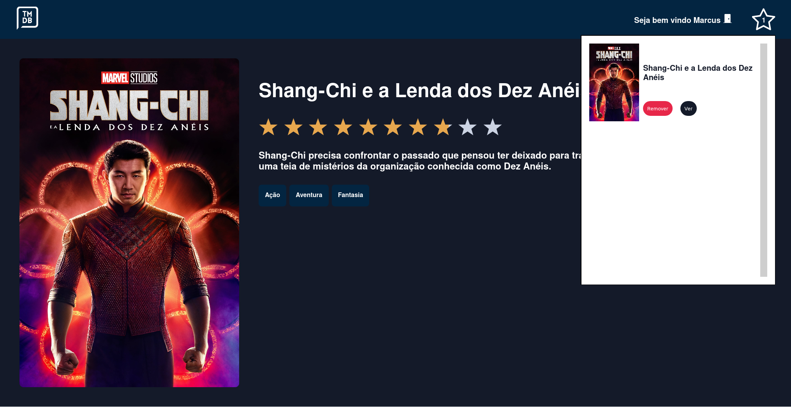
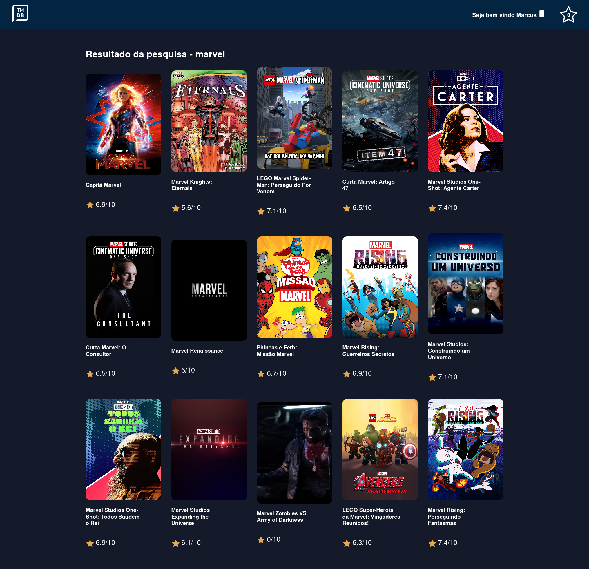
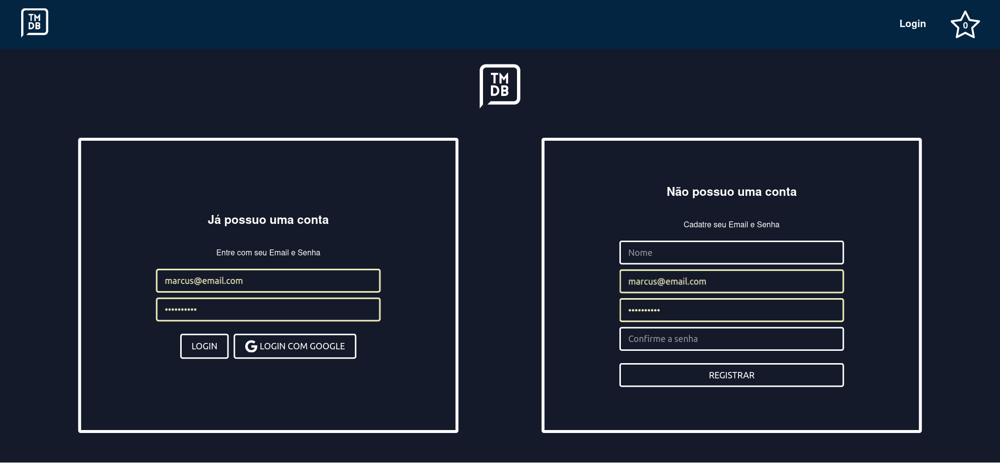

# Bem Vindo ao MovieDB React App

## Projeto desenvolvido com React + Styled Components + MovieDB API

https://mymoviedb-app.netlify.app/

## Tecnologias utilizadas

- React
- React Router Dom
- Context API
- Styled-components

## Instruções de Instalação

1. Clone o repositorio

`https://github.com/marcusjava/react_movieDB`

2. Instalação
   Pré-requisitos: NodeJS instalado `https://nodejs.org/en/`

- Instalar dependencias - `yarn install`
- Criar conta no site https://www.themoviedb.org
- Gerar key para acesso a API em https://www.themoviedb.org/settings/api
- Criar arquivo .env na raiz do projeto com a seguinte variavel `REACT_APP_MOVIEDB_API_KEY="KEY GERADA"`
- Iniciar projeto - `yarn start`
